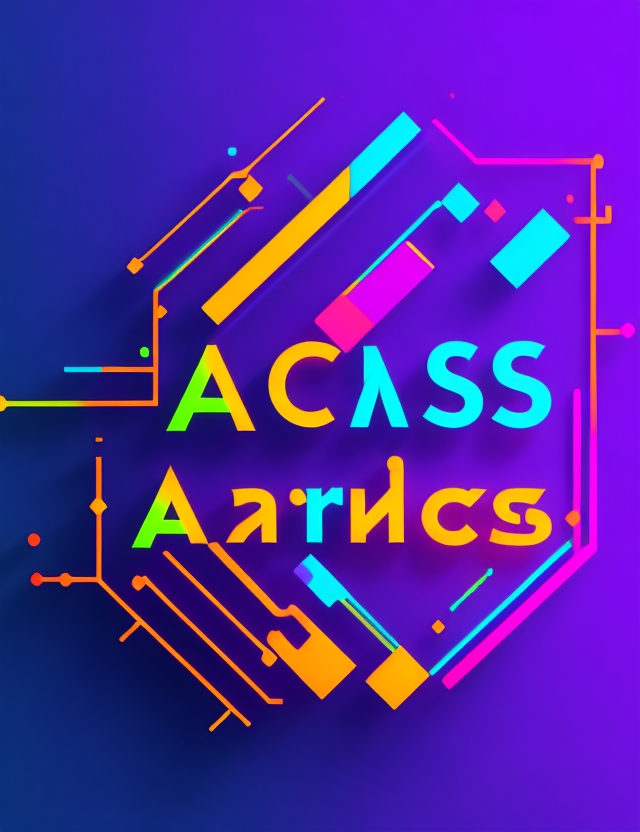

<h1 align="center">Proyecto de Ordenamiento de Números</h1>

  

---

## 📋 Descripción

Este proyecto es una interfaz gráfica en Python que permite ordenar arreglos de números utilizando diversos algoritmos de ordenamiento. Proporciona una experiencia intuitiva y amigable para el usuario, permitiendo ingresar el tamaño del arreglo y generando números aleatorios para su ordenamiento.

---

## 🚀 Características

- Interfaz gráfica de usuario intuitiva y amigable
- Algoritmos de ordenamiento iterativos y recursivos implementados
- Representación visual de los pasos de cada algoritmo durante el proceso de ordenamiento
- Opción de visualizar el arreglo ordenado final de manera clara y concisa

---

## ⚙️ Tecnologías Utilizadas

- Python
- Biblioteca tkinter

---

## 🎯 Objetivos del Proyecto

- Crear una interfaz gráfica de usuario que proporcione una experiencia intuitiva y amigable para el usuario, permitiendo ingresar el tamaño del arreglo y generar un arreglo de números aleatorios.
- Implementar algoritmos de ordenamiento iterativos y recursivos, como Bubble Sort, Insertion Sort, Selection Sort, Shell Sort, Quick Sort, Merge Sort y Heap Sort, para permitir al usuario observar y comparar los pasos de cada algoritmo durante el proceso de ordenamiento.
- Proporcionar al usuario la opción de seleccionar y visualizar únicamente el resultado final de cada algoritmo de ordenamiento, mostrando el arreglo ordenado de manera clara y concisa.

---

## 📄 Instrucciones de Uso

1. Clona o descarga este repositorio.
2. Instala Python en tu computadora si aún no lo tienes.
3. Ejecuta el archivo `main.py`.
4. Ingresa el tamaño del arreglo deseado y haz clic en el botón "Generar Arreglo".
5. Observa los pasos de cada algoritmo de ordenamiento en la ventana de resultados.
6. Se mostrará el arreglo ordenado final para cada algoritmo.

---

## 📚 Referencias

- Gutiérrez, L. (2019). Python para todos. Universidad de Valladolid.
- Brassard, G., & Bratley, P. (1997). Fundamentos de algoritmos. Prentice Hall.
- Cormen, T. H., Leiserson, C. E., Rivest, R. L., & Stein, C. (2009). Introduction to Algorithms. MIT Press.
- Roseman, R., & Palmer, J. (2000). Tkinter reference: A GUI for Python.

---

## 📝 Contribuciones

¡Las contribuciones son bienvenidas! Si deseas mejorar este proyecto, por favor realiza un fork y crea un pull request. Estaré encantado de revisarlo.

---

## 📞 Contacto

Si tienes alguna pregunta o sugerencia, no dudes en contactarme a través de [esherrera@uce.edu.ec] o en Twitter [@k0t3tsu](https://twitter.com/k0t3tsu).

---

¡Gracias por visitar este proyecto! Espero que sea útil y satisfaga tus necesidades de ordenamiento de números. 🔢❤️
